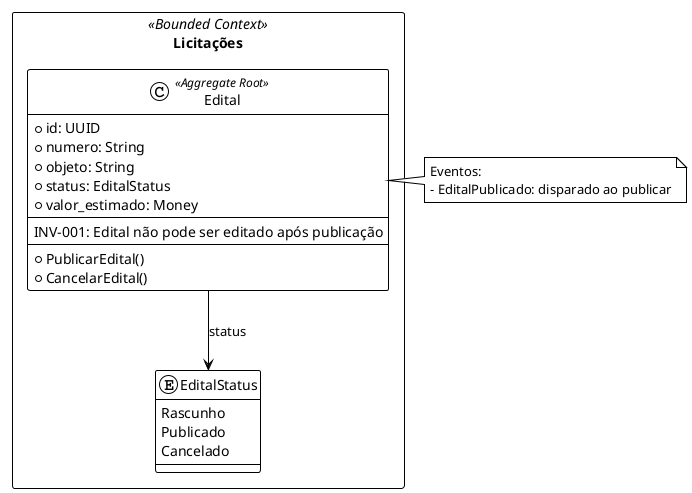

# Capability DC — Diagram Classes (Bounded Contexts/Aggregates)

**Quando usar**: Gerar diagrama de bounded contexts/aggregates/entities do ANEXO_B.

**Input**: `{project_root}/artifacts/ANEXO_B_DataModels.md`

**Output**: `{project_root}/artifacts/diagrams/domain-classes-{timestamp}.puml`

---

## Pré-Condições

**Arquivo requerido**: `ANEXO_B_DataModels.md` DEVE existir

**Conteúdo mínimo**: Pelo menos 3 documentos principais detalhados com campos, tipos e relacionamentos

---

## O Que Extrair do ANEXO_B

### 1. Documentos Principais (Aggregates)
- Nome do documento (ex: "Edital de Licitação")
- Se é aggregate root (geralmente mencionado como "documento principal" ou similar)

### 2. Campos de Cada Documento
- Nome do campo
- Tipo (String, Integer, Date, Money, UUID, etc.)
- Obrigatoriedade (required/optional)
- Validações (se mencionadas)

### 3. Relacionamentos
- Documento A relaciona-se com Documento B
- Cardinalidade (1:1, 1:N, N:N)
- Navegabilidade (bidirecional ou unidirecional)

### 4. Enums
- Nome do enum
- Valores possíveis

### 5. Invariantes
Regras de negócio que sempre devem ser verdadeiras:
- Exemplo: "valor_total_proposta <= valor_estimado_edital"

### 6. Comandos
Operações que mudam estado:
- Nome do comando
- Documento alvo

### 7. Eventos de Domínio
Notificações de mudança de estado:
- Nome do evento
- Quando é disparado

---

## Template PlantUML (Domain Classes)

```plantuml
@startuml Domain Model - {PROJECT_NAME}
!theme plain

' ============================================================================
' Bounded Contexts e Aggregates
' Gerado a partir de: ANEXO_B_DataModels.md
' Data: {TIMESTAMP}
' ============================================================================

' Configuração de estilo
skinparam packageStyle rectangle
skinparam class {
  BackgroundColor<<AggregateRoot>> LightYellow
  BorderColor<<AggregateRoot>> Orange
  BackgroundColor<<ValueObject>> LightBlue
  BorderColor<<ValueObject>> Blue
  BackgroundColor<<Entity>> White
  BorderColor<<Entity>> Black
}

' ============================================================================
' Bounded Context: [Nome do Contexto]
' ============================================================================

package "[Nome Bounded Context]" <<Bounded Context>> {

  ' Aggregate Root
  class [NomeDocumento] <<Aggregate Root>> {
    ' Campos (extraídos do ANEXO_B)
    +campo1: TipoCampo1
    +campo2: TipoCampo2
    +campo3: TipoCampo3
    --
    ' Invariantes (regras de negócio)
    {field} Invariante: [descrição da regra]
    --
    ' Comandos (operações que mudam estado)
    +comando1()
    +comando2()
    +comando3()
  }

  ' Enums (se houver)
  enum [NomeEnum] {
    VALOR1
    VALOR2
    VALOR3
  }

  ' Value Objects (se houver)
  class [NomeValueObject] <<Value Object>> {
    +atributo1: Tipo1
    +atributo2: Tipo2
  }

  ' Relacionamentos
  [NomeDocumento] --> [NomeEnum] : status
  [NomeDocumento] *-- [NomeValueObject] : campo_composto
}

' ============================================================================
' Bounded Context: [Outro Contexto, se houver]
' ============================================================================

package "[Outro Bounded Context]" <<Bounded Context>> {
  ' ... repetir estrutura acima
}

' ============================================================================
' Relacionamentos entre Bounded Contexts
' ============================================================================

[DocumentoContexto1] --> [DocumentoContexto2] : referencia\n[cardinalidade]

' ============================================================================
' Notas e Invariantes Globais
' ============================================================================

note right of [NomeDocumento]
  Invariantes:
  - [Regra de negócio 1]
  - [Regra de negócio 2]

  Eventos:
  - [Evento1]: disparado ao [ação]
  - [Evento2]: disparado ao [ação]
end note

@enduml
```

---

## Workflow (Capability DC — 7 Steps)

### Step 1: Verificar Pré-Condições

```bash
# Verificar se ANEXO_B existe
[ -f artifacts/ANEXO_B_DataModels.md ] || ERROR "ANEXO_B não encontrado"

# Verificar se está completo (heurística: >= 100 linhas, >= 3 documentos mencionados)
wc -l artifacts/ANEXO_B_DataModels.md
grep -c "^### Documento:" artifacts/ANEXO_B_DataModels.md
```

**Se pré-condições falharem**: Reportar erro ao usuário com sugestões de ação (ver `diagrama-designer-core.md` seção "Tratamento de Erros")

---

### Step 2: Ler e Analisar ANEXO_B

1. Ler arquivo completo usando Read tool
2. Identificar bounded contexts mencionados (seções principais)
3. Listar documentos principais por contexto
4. Para cada documento, extrair:
   - Campos com tipos
   - Relacionamentos com cardinalidades
   - Invariantes
   - Comandos
   - Eventos de domínio
   - Enums (se houver)

**Dica de Leitura**:
- Use Grep para localizar seções rapidamente:
  - `grep -n "^## Bounded Context" artifacts/ANEXO_B_DataModels.md`
  - `grep -n "^### Documento:" artifacts/ANEXO_B_DataModels.md`
  - `grep -n "^#### Campos" artifacts/ANEXO_B_DataModels.md`

---

### Step 3: Executar Checklist de Qualidade

**Checklist obrigatório** (do `diagrama-designer-core.md`):
- [ ] Todos os documentos mencionados têm lista de campos especificada?
- [ ] Todos os campos têm tipo claramente definido (String, Integer, Date, etc.)?
- [ ] Relacionamentos entre documentos têm cardinalidade explícita (1:1, 1:N, N:N)?
- [ ] Invariantes de negócio (regras que sempre devem ser verdadeiras) estão documentados?
- [ ] Comandos principais (operações que mudam estado) estão listados?
- [ ] Eventos de domínio (notificações de mudança de estado) estão identificados?
- [ ] Enums (se houver) têm valores possíveis listados?

**Se QUALQUER checkbox estiver desmarcado**:
- → QUESTIONAR USUÁRIO (usar template de questionamento do core)
- → OU SOLICITAR APERFEIÇOAMENTO ao Analista de Negócio (usar template de solicitação do core)

**NÃO prossiga para Step 4 se checklist falhar!**

---

### Step 4: Gerar Código PlantUML

1. Copiar template PlantUML acima
2. Substituir placeholders:
   - `{PROJECT_NAME}` → Nome do projeto (ler de PROJECT.md ou .claude-context)
   - `{TIMESTAMP}` → Data/hora atual (formato: YYYY-MM-DD HH:MM:SS)
   - `[Nome Bounded Context]` → Nomes extraídos do ANEXO_B
   - `[NomeDocumento]` → Documentos extraídos
   - `[campo1, campo2...]` → Campos extraídos com tipos
   - `[NomeEnum]` → Enums identificados
   - `[Invariante]` → Regras de negócio extraídas
   - `[comando1(), comando2()]` → Comandos extraídos

3. Preservar **nomes EXATOS** do ANEXO (case-sensitive):
   - ✅ "EditalDeLicitacao" se está assim no ANEXO
   - ❌ NÃO normalizar para "Edital" se não está assim no ANEXO

4. Adicionar **comentários explicativos** no código PlantUML:
   ```plantuml
   ' Campo extraído de ANEXO_B, Seção: Documento Edital, Campo: numero
   +numero: String
   ```

5. Organizar bounded contexts alfabeticamente (se múltiplos)

6. Adicionar notas explicativas para invariantes complexas

---

### Step 5: Salvar Arquivo

```bash
# Criar diretório se não existir
mkdir -p artifacts/diagrams

# Gerar timestamp (formato: YYYYMMDD-HHMMSS)
TIMESTAMP=$(date +%Y%m%d-%H%M%S)

# Salvar arquivo
cat > artifacts/diagrams/domain-classes-$TIMESTAMP.puml <<'EOF'
[código PlantUML gerado no Step 4]
EOF
```

**Nome do arquivo**: `domain-classes-{timestamp}.puml`
- Exemplo: `domain-classes-20260417-143000.puml`

---

### Step 6: Fornecer Instruções de Visualização

**Template de resposta ao usuário**:

```markdown
✅ **Diagrama de Classes Gerado com Sucesso**

📄 **Arquivo**: `artifacts/diagrams/domain-classes-{timestamp}.puml`

📊 **Visualizar o Diagrama**:

**Opção 1: PlantUML Online (Recomendado)**
1. Acesse: https://www.plantuml.com/plantuml/uml/
2. Cole o conteúdo do arquivo `.puml` na caixa de texto
3. Clique em "Submit" para renderizar

**Opção 2: VS Code (se instalado)**
1. Instale extensão: "PlantUML" (jebbs.plantuml)
2. Abra arquivo `.puml` no VS Code
3. Pressione `Alt+D` para preview

**Opção 3: CLI (se plantuml instalado)**
```bash
plantuml artifacts/diagrams/domain-classes-{timestamp}.puml
# Gera: domain-classes-{timestamp}.png
```

**Conteúdo Representado**:
- [X] Bounded Contexts identificados: [listar nomes]
- [X] Aggregates e Entities: [listar documentos principais]
- [X] Campos com tipos: [quantidade total de campos]
- [X] Relacionamentos com cardinalidades: [quantidade de relacionamentos]
- [X] Invariantes de negócio: [quantidade]
- [X] Comandos principais: [quantidade]
- [X] Eventos de domínio: [quantidade]

**Fidelidade ao ANEXO_B**: ✅ 100% (nada inventado, nada omitido)
```

---

### Step 7: Validação Final (Auto-Check)

**Antes de reportar sucesso, validar**:

1. Arquivo `.puml` foi criado em `artifacts/diagrams/`?
2. Timestamp está correto no nome do arquivo?
3. Sintaxe PlantUML está correta? (verificar mentalmente: @startuml presente? @enduml presente? Chaves balanceadas?)
4. Todos os bounded contexts do ANEXO_B foram representados?
5. Todos os documentos mencionados no ANEXO_B estão no diagrama?
6. Nenhum campo/relacionamento foi inventado (não está no ANEXO)?
7. Nomes estão case-sensitive corretos (idênticos ao ANEXO)?

**Se qualquer validação falhar**: Corrigir antes de reportar sucesso.

---

## Exemplos Práticos

### Exemplo 1: ANEXO_B Simples (1 Bounded Context, 2 Documentos)

**Input (ANEXO_B)**:
```markdown
## Bounded Context: Licitações

### Documento: Edital
- id: UUID
- numero: String (formato: EDI-YYYY-NNNN)
- objeto: String
- status: EditalStatus (enum: Rascunho, Publicado, Cancelado)
- valor_estimado: Money

**Relacionamentos**:
- Edital → Departamento (N:1)

**Invariantes**:
- INV-001: Edital não pode ser editado após publicação (status != 'Publicado')

**Comandos**:
- PublicarEdital
- CancelarEdital

**Eventos**:
- EditalPublicado: disparado ao publicar
```

**Output (PlantUML gerado)**:


---

### Exemplo 2: Ambiguidade Detectada (Checklist Falhou)

**Input (ANEXO_B)**:
```markdown
### Documento: Proposta
- id: UUID
- valor: Money
- Proposta está vinculada a Edital
```

**Diana detecta**: Relacionamento sem cardinalidade (checklist falhou no item 3)

**Diana responde** (usando template de questionamento do core):
```markdown
⚠️ **Ambiguidade Detectada no ANEXO_B**

**Seção do ANEXO**: Documento: Proposta

**Trecho Ambíguo**:
> "Proposta está vinculada a Edital"

**Ambiguidade Identificada**:
Não está claro a cardinalidade do relacionamento.

**Possíveis Interpretações**:
1. **1:N** (um edital pode ter múltiplas propostas, mas proposta pertence a apenas um edital)
   - Diagrama: `Edital "1" --> "0..*" Proposta`
2. **N:N** (propostas podem referenciar múltiplos editais)
   - Diagrama: `Edital "*" --> "*" Proposta`

**Pergunta**: Qual interpretação está correta?

⏸️ **Aguardando esclarecimento antes de gerar o diagrama.**
```

---

## Referências

- **Princípios Críticos completos**: Ver `diagrama-designer-core.md` seção "PRINCÍPIOS CRÍTICOS"
- **Templates de questionamento**: Ver `diagrama-designer-core.md` seção "Questionar Quando Não Entender"
- **Tratamento de erros**: Ver `diagrama-designer-core.md` seção "Tratamento de Erros"
- **PlantUML Class Diagram Syntax**: https://plantuml.com/class-diagram

---

**Versão**: 3.3 (Layer Architecture)
**Data**: 2026-04-17
