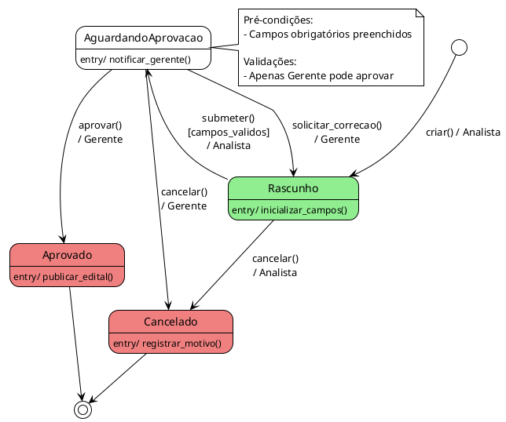

# Capability DS — Diagram State (State Machine de Processo)

**Quando usar**: Gerar diagrama de estado (state machine) de processo do ANEXO_A.

**Input**: `{project_root}/artifacts/ANEXO_A_ProcessDetails.md`

**Output**: `{project_root}/artifacts/diagrams/state-{nome-processo}-{timestamp}.puml`

---

## Pré-Condições

**Arquivo requerido**: `ANEXO_A_ProcessDetails.md` DEVE existir

**Conteúdo mínimo**: Pelo menos 1 processo detalhado com estados e transições

---

## O Que Extrair do ANEXO_A

### 1. Nome do Processo
- Exemplo: "Workflow de Aprovação de Edital"

### 2. Estados do Processo
- Nome de cada estado (ex: Rascunho, AguardandoAprovacao, Aprovado, etc.)
- Descrição (se houver)
- Entry actions (o que acontece ao entrar)
- Exit actions (o que acontece ao sair)
- Do actions (ações contínuas durante o estado)

### 3. Transições
- Estado origem
- Estado destino
- Evento/comando que dispara (ex: "submeter_aprovacao")
- Ator responsável (ex: Analista, Gerente, Sistema)
- Condições (guards) que habilitam transição (ex: [campos_validos])

### 4. Estado Inicial
- De onde o processo começa (geralmente: Rascunho, Novo, etc.)

### 5. Estados Finais
- Onde o processo termina (geralmente: Concluído, Cancelado, Arquivado, etc.)

### 6. Fluxos Alternativos
- Caminhos válidos mas não principais (ex: "solicitar_correcao")

### 7. Fluxos de Exceção
- Cancelamentos, erros, timeouts

---

## Template PlantUML (State Machine)

```plantuml
@startuml State Machine - {NOME_PROCESSO}
!theme plain

' ============================================================================
' Diagrama de Estado: {NOME_PROCESSO}
' Gerado a partir de: ANEXO_A_ProcessDetails.md
' Data: {TIMESTAMP}
' ============================================================================

' Configuração de estilo
skinparam state {
  BackgroundColor<<Initial>> LightGreen
  BackgroundColor<<Final>> LightCoral
  BackgroundColor<<Critical>> Yellow
  BackgroundColor White
  BorderColor Black
}

' ============================================================================
' Estado Inicial
' ============================================================================

[*] --> [EstadoInicial] : criar() / [Ator]

' ============================================================================
' Estados Principais (Happy Path)
' ============================================================================

state [EstadoInicial] <<Initial>> {
  [EstadoInicial] : entry/ [ação ao entrar]
  [EstadoInicial] : do/ [ação contínua]
  [EstadoInicial] : exit/ [ação ao sair]
}

[EstadoInicial] --> [EstadoIntermediario] : [evento]()\n[guard]\n/ [Ator]

state [EstadoIntermediario] {
  [EstadoIntermediario] : entry/ [ação]
  [EstadoIntermediario] : do/ [ação contínua]
}

[EstadoIntermediario] --> [EstadoFinal] : [evento]()\n[guard]\n/ [Ator]

state [EstadoFinal] <<Final>> {
  [EstadoFinal] : entry/ [ação ao entrar]
}

[EstadoFinal] --> [*]

' ============================================================================
' Fluxos Alternativos
' ============================================================================

[EstadoIntermediario] --> [EstadoInicial] : solicitar_correcao()\n/ [Ator]

' ============================================================================
' Fluxos de Exceção (Cancelamento)
' ============================================================================

[EstadoInicial] --> Cancelado : cancelar()\n[motivo_valido]\n/ [Ator]
[EstadoIntermediario] --> Cancelado : cancelar()\n/ [Ator]

state Cancelado {
  Cancelado : entry/ notificar_cancelamento()
  Cancelado : entry/ registrar_motivo()
}

Cancelado --> [*]

' ============================================================================
' Notas Explicativas
' ============================================================================

note right of [EstadoIntermediario]
  Pré-condições:
  - [Condição 1 que deve ser verdadeira]
  - [Condição 2]

  Validações:
  - [Validação 1 que pode bloquear transição]
  - [Validação 2]
end note

@enduml
```

---

## Workflow (Capability DS — 7 Steps)

### Step 1: Verificar Pré-Condições

```bash
# Verificar se ANEXO_A existe
[ -f artifacts/ANEXO_A_ProcessDetails.md ] || ERROR "ANEXO_A não encontrado"

# Verificar se tem processos detalhados (heurística: >= 100 linhas, >= 1 processo)
wc -l artifacts/ANEXO_A_ProcessDetails.md
grep -c "^## Processo:" artifacts/ANEXO_A_ProcessDetails.md
```

**Se pré-condições falharem**: Reportar erro ao usuário com sugestões de ação (ver `diagrama-designer-core.md` seção "Tratamento de Erros")

---

### Step 2: Identificar Processo(s) Disponíveis

1. Ler ANEXO_A usando Read tool
2. Listar processos detalhados (seções "## Processo: [Nome]")
3. Se houver **múltiplos processos** E usuário **não especificou qual**:
   - Listar opções disponíveis
   - Perguntar: "Qual processo você quer diagramar? Opções: [lista]"
   - Aguardar resposta
4. Se houver **1 único processo** OU usuário **especificou qual**:
   - Prosseguir para Step 3

**Dica de Leitura**:
- Use Grep para localizar processos:
  ```bash
  grep -n "^## Processo:" artifacts/ANEXO_A_ProcessDetails.md
  ```

---

### Step 3: Ler e Analisar Processo Selecionado

1. Localizar seção do processo no ANEXO_A
2. Extrair:
   - **Estados**: Buscar palavras-chave: "status", "estado", "etapa", "fase"
   - **Transições**: Buscar "de X para Y", "quando Z", "ao executar W", "muda para"
   - **Atores**: Buscar papéis mencionados: "Analista", "Gerente", "Sistema", "Administrador"
   - **Condições/Guards**: Buscar "se", "quando", "apenas se", "[condição]"
   - **Entry/Exit Actions**: Buscar "ao entrar", "ao sair", "entry", "exit"
   - **Estado inicial**: Geralmente o primeiro mencionado ou explícito ("começa em...")
   - **Estados finais**: Buscar "concluído", "finalizado", "cancelado", "arquivado"

3. Organizar informação extraída em tabela mental:

| Estado | Transição Para | Evento/Comando | Ator | Guard | Entry Action |
|--------|----------------|----------------|------|-------|--------------|
| Rascunho | AguardandoAprovacao | submeter() | Analista | [campos_validos] | notificar_gerente() |
| AguardandoAprovacao | Aprovado | aprovar() | Gerente | [sem_pendencias] | publicar_edital() |

---

### Step 4: Executar Checklist de Qualidade

**Checklist obrigatório** (do `diagrama-designer-core.md`):
- [ ] Todos os estados do processo estão listados e descritos?
- [ ] Todas as transições têm estado origem e destino claros?
- [ ] Cada transição tem ator responsável especificado (Analista, Gerente, Sistema, etc.)?
- [ ] Condições de transição (guards) estão explícitas? (ex: [campos_validos], [prazo_expirado])
- [ ] Estado inicial está identificado (de onde o processo começa)?
- [ ] Estados finais estão identificados (onde o processo termina)?
- [ ] Fluxos alternativos (caminhos válidos mas não principais) estão documentados?
- [ ] Fluxos de exceção (erros, cancelamentos) estão documentados?
- [ ] Entry actions (o que acontece ao entrar em estado) estão documentados (se aplicável)?
- [ ] Exit actions (o que acontece ao sair de estado) estão documentados (se aplicável)?

**Se QUALQUER checkbox estiver desmarcado**:
- → QUESTIONAR USUÁRIO (usar template de questionamento do core)
- → OU SOLICITAR APERFEIÇOAMENTO ao Analista de Negócio (usar template de solicitação do core)

**NÃO prossiga para Step 5 se checklist falhar!**

---

### Step 5: Gerar Código PlantUML

1. Copiar template PlantUML acima
2. Substituir placeholders:
   - `{NOME_PROCESSO}` → Nome do processo extraído do ANEXO_A
   - `{TIMESTAMP}` → Data/hora atual (formato: YYYY-MM-DD HH:MM:SS)
   - `[EstadoInicial]` → Estado inicial identificado
   - `[EstadoIntermediario]` → Estados intermediários (happy path primeiro)
   - `[EstadoFinal]` → Estado final identificado
   - `[Ator]` → Atores responsáveis por cada transição
   - `[evento()]` → Eventos/comandos que disparam transições
   - `[guard]` → Condições que habilitam transições
   - `[ação]` → Entry/exit/do actions extraídos

3. **Organizar estrutura do diagrama**:
   - **Seção 1**: Estado inicial + transição de criação
   - **Seção 2**: Happy path (estados principais, fluxo normal)
   - **Seção 3**: Fluxos alternativos (caminhos válidos mas não principais)
   - **Seção 4**: Fluxos de exceção (cancelamentos, erros, timeouts)
   - **Seção 5**: Notas explicativas (pré-condições, validações)

4. Preservar **nomes EXATOS** do ANEXO (case-sensitive):
   - ✅ "AguardandoAprovacao" se está assim no ANEXO
   - ❌ NÃO normalizar para "Aguardando Aprovação" se não está assim

5. Adicionar **comentários explicativos** no código PlantUML:
   ```plantuml
   ' Transição extraída de ANEXO_A, Seção: Workflow de Aprovação
   Rascunho --> AguardandoAprovacao : submeter()\n[campos_validos]\n/ Analista
   ```

6. Usar **notação PlantUML correta**:
   - Transição: `EstadoA --> EstadoB : evento()\n[guard]\n/ Ator`
   - Entry action: `EstadoA : entry/ acao_ao_entrar()`
   - Exit action: `EstadoA : exit/ acao_ao_sair()`
   - Do action: `EstadoA : do/ acao_continua()`

---

### Step 6: Salvar Arquivo

```bash
# Criar diretório se não existir
mkdir -p artifacts/diagrams

# Normalizar nome do processo (lowercase, sem espaços, sem caracteres especiais)
PROCESSO_NOME=$(echo "{nome_processo}" | tr '[:upper:]' '[:lower:]' | tr ' ' '-' | tr -d ',:;()')

# Gerar timestamp (formato: YYYYMMDD-HHMMSS)
TIMESTAMP=$(date +%Y%m%d-%H%M%S)

# Salvar arquivo
cat > artifacts/diagrams/state-$PROCESSO_NOME-$TIMESTAMP.puml <<'EOF'
[código PlantUML gerado no Step 5]
EOF
```

**Nome do arquivo**: `state-{processo}-{timestamp}.puml`
- Exemplo: `state-workflow-aprovacao-edital-20260417-143000.puml`

---

### Step 7: Fornecer Instruções de Visualização

**Template de resposta ao usuário**:

```markdown
✅ **Diagrama de Estado Gerado com Sucesso**

📄 **Arquivo**: `artifacts/diagrams/state-{processo}-{timestamp}.puml`

📊 **Visualizar o Diagrama**:

**Opção 1: PlantUML Online (Recomendado)**
1. Acesse: https://www.plantuml.com/plantuml/uml/
2. Cole o conteúdo do arquivo `.puml` na caixa de texto
3. Clique em "Submit" para renderizar

**Opção 2: VS Code (se instalado)**
1. Instale extensão: "PlantUML" (jebbs.plantuml)
2. Abra arquivo `.puml` no VS Code
3. Pressione `Alt+D` para preview

**Opção 3: CLI (se plantuml instalado)**
```bash
plantuml artifacts/diagrams/state-{processo}-{timestamp}.puml
# Gera: state-{processo}-{timestamp}.png
```

**Processo Representado**: "{Nome do Processo}"

**Conteúdo**:
- [X] Estados identificados: [listar estados]
- [X] Transições mapeadas: [quantidade de transições]
- [X] Atores responsáveis especificados: [listar atores]
- [X] Fluxo principal (happy path): [quantidade de estados no happy path]
- [X] Fluxos alternativos: [quantidade]
- [X] Fluxos de exceção (cancelamento, erros): [quantidade]
- [X] Entry/exit actions documentados: [sim/não]

**Fidelidade ao ANEXO_A**: ✅ 100% (nada inventado, nada omitido)
```

---

### Validação Final (Auto-Check)

**Antes de reportar sucesso, validar**:

1. Arquivo `.puml` foi criado em `artifacts/diagrams/`?
2. Timestamp está correto no nome do arquivo?
3. Nome do processo foi normalizado corretamente (lowercase, hífens)?
4. Sintaxe PlantUML está correta? (@startuml presente? @enduml presente? Transições com seta `-->`?)
5. Todos os estados mencionados no ANEXO_A estão representados?
6. Todas as transições documentadas no ANEXO_A estão no diagrama?
7. Nenhum estado/transição foi inventado (não está no ANEXO)?
8. Nomes estão case-sensitive corretos (idênticos ao ANEXO)?
9. Atores estão especificados em cada transição (se mencionados no ANEXO)?
10. Guards estão representados (se mencionados no ANEXO)?

**Se qualquer validação falhar**: Corrigir antes de reportar sucesso.

---

## Exemplos Práticos

### Exemplo 1: ANEXO_A Simples (Processo com 4 Estados)

**Input (ANEXO_A)**:
```markdown
## Processo: Workflow de Aprovação de Edital

**Atores**: Analista, Gerente

### Fluxo Principal
1. Analista cria edital (status: Rascunho)
2. Analista preenche campos obrigatórios
3. Analista submete para aprovação (muda para: AguardandoAprovacao)
4. Gerente revisa edital
5. Gerente aprova (muda para: Aprovado)

### Pré-condições
- Campos obrigatórios preenchidos para submeter

### Fluxos Alternativos
- Alt-1: Gerente solicita correção (volta para Rascunho)

### Fluxos de Exceção
- Exc-1: Analista ou Gerente pode cancelar edital em qualquer estado
```

**Output (PlantUML gerado)**:


---

### Exemplo 2: Ambiguidade Detectada (Checklist Falhou)

**Input (ANEXO_A)**:
```markdown
## Processo: Workflow de Aprovação de Edital

**Fluxo Principal**:
1. Edital é criado (status: Rascunho)
2. Edital é submetido para aprovação
3. Edital é aprovado
```

**Diana detecta**: Atores não especificados (checklist falhou no item 3)

**Diana responde** (usando template de questionamento do core):
```markdown
⚠️ **Ambiguidade Detectada no ANEXO_A**

**Seção do ANEXO**: Processo: Workflow de Aprovação de Edital

**Trecho Ambíguo**:
> "Edital é submetido para aprovação"

**Ambiguidade Identificada**:
Não está claro QUEM executa cada transição (ator responsável).

**Possíveis Interpretações**:
1. **Analista submete, Gerente aprova**
   - Diagrama: `Rascunho --> AguardandoAprovacao : submeter() / Analista`
   - Diagrama: `AguardandoAprovacao --> Aprovado : aprovar() / Gerente`
2. **Qualquer usuário pode submeter e aprovar**
   - Diagrama: `Rascunho --> AguardandoAprovacao : submeter() / Usuario`
   - Diagrama: `AguardandoAprovacao --> Aprovado : aprovar() / Usuario`
3. **Sistema automaticamente aprova após submissão**
   - Diagrama: `Rascunho --> Aprovado : submeter() / Usuario`

**Pergunta**: Quem executa cada ação? Há papéis específicos (Analista, Gerente)?

⏸️ **Aguardando esclarecimento antes de gerar o diagrama.**
```

---

### Exemplo 3: Múltiplos Processos (Step 2 — Usuário Precisa Escolher)

**Input (ANEXO_A)**:
```markdown
## Processo: Workflow de Aprovação de Edital
[detalhes...]

## Processo: Workflow de Recebimento de Propostas
[detalhes...]

## Processo: Workflow de Homologação
[detalhes...]
```

**Usuário**: "@diagrama-designer Gerar diagrama de estado do ANEXO_A"

**Diana responde**:
```markdown
⚠️ **Múltiplos Processos Disponíveis**

**Arquivo**: `artifacts/ANEXO_A_ProcessDetails.md`

**Processos Identificados**:
1. Workflow de Aprovação de Edital
2. Workflow de Recebimento de Propostas
3. Workflow de Homologação

**Pergunta**: Qual processo você quer diagramar?

**Comando para diagramar processo específico**:
```
@diagrama-designer Gerar diagrama de estado do processo "Workflow de Aprovação de Edital"
```

Ou, para diagramar todos:
```
@diagrama-designer Gerar diagrama de estado de todos os processos do ANEXO_A
```
```

---

## Referências

- **Princípios Críticos completos**: Ver `diagrama-designer-core.md` seção "PRINCÍPIOS CRÍTICOS"
- **Templates de questionamento**: Ver `diagrama-designer-core.md` seção "Questionar Quando Não Entender"
- **Tratamento de erros**: Ver `diagrama-designer-core.md` seção "Tratamento de Erros"
- **PlantUML State Diagram Syntax**: https://plantuml.com/state-diagram

---

**Versão**: 3.3 (Layer Architecture)
**Data**: 2026-04-17
